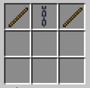
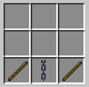
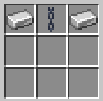
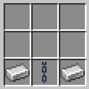
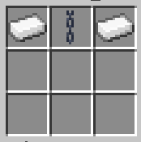
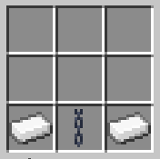
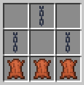

# Combat and jailing
Avatarverse has unique combat mechanics, which are integral to understanding wars and personal safety on the server.

## Combat tag
If you are attacked or you attack someone, you will be placed in a 15-second combat tag, which means you cannot use certain commands that would aid in your escape, and you will be punished if you leave during combat.

## Knockouts
Under normal circumstances, if your health reaches zero, you are knocked out. This means you are forced to lie down on the ground (if possible) and cannot move, attack people, or get attacked. This state lasts 60 seconds.

You are also vulnerable to a number of threats: people can sneak & right-click on your body to open your inventory and take any item out of it; and you can also be handcuffed, shackled, or gagged. You can read more about the latter in the “Shackles” section below.

If you leave the game while knocked out, you will be knocked out again when you rejoin the server and have to endure another 60 seconds. If you leave the game while in combat, you will be knocked out upon your return.

## Duels
Duels are a way one can avoid being knocked out when the health bar reaches zero. They are designed for quick, friendly spars so you don’t have to wait for the knockout to end when someone loses the duel.

To duel someone, send a duel request with **/duel <character>**. They will have the opportunity of accepting it with the same command (with your username instead of theirs), or denying it just by ignoring it.

You can also duel to the death with **/duel <character> death**. You can read more about DttDs (Duels to the Death) in the “Character death” section above.

## Hunts
The main way of killing someone without their consent is by starting a hunt. Using **/murder <character>** or **/hunt <character>** will give you an item, the Murderer’s Knife. After acquiring the knife, you will have 30 minutes to hit them with the knife while they’re knocked out, which will delete their character.

If you’re successful in killing them by the time is up, you’ll have to wait 3 days before you can kill again. If you’re unsuccessful, you’ll have to wait 5 days. The timer will only run when both the hunter and victim are online, so logging off won’t let you escape a hunt.

You can only begin a hunt against someone who is not knocked out and who has at least 5 hearts of health.

## Shackles
Certain craftable items can be used on someone who is knocked out in order to limit their movement and bending and make them easier to control.

There are two different types of shackles: (1) **handcuffs**, which go on people’s chest slots; and (2) **shackles**, which go on people’s feet slots. There are three materials that can be used to craft handcuffs and shackles: (1) **wood**, (2) **iron**, and (3) **platinum**, from weakest to strongest durability.

**Handcuffs** have the following effects on people:
- Unable to punch other entities
- Interaction with hands will be limited
- Able to be dragged to another location by anyone

**Shackles** have the following effects on people:
- Slowness III
- Unable to use bending abilities that require sneaking

Handcuffed individuals can be **dragged** to another location. Tap sneak while looking at someone who’s handcuffed to start dragging them. They will be teleported to wherever you go. You can stop dragging them by tapping sneak on them again. Dragging will be interrupted if you take damage.

Shackles can be **unlocked** with the use of a **key item** that is generated when shackles are placed on someone. The key will only work for those specific shackles. To unlock someone’s shackles, right-click on them with the right key.

Shackles can also be **lockpicked** by right-clicking on someone with a tripwire hook. This will enter you into a sort of GUI mini-game. The more durable the shackle, the harder it is to lockpick. You can’t lockpick your own shackles.

There are ways to escape shackles, but most require a lot of work:
- **Any handcuff and shackle** can take a little bit of damage if you **repeatedly left-click**, as if you’re hitting them against an object, but this won’t work for every punch and will damage you as well.
- **Any handcuff** will take damage from holding sneak on **HeatControl** (burning/melting the handcuff).
- **Wooden handcuffs** and shackles will take damage if you hold sneak with **FrostBreath**.
- **Iron handcuffs and shackles** are escapable with holding sneak with any **metalbending** move.

Another neat item that can be placed on someone when they’re knocked out is the **gag**. This prevents people from speaking: everything they say will come out as “*muffled*”. They will also be unable to use "breath" abilities (AirBreath, FrostBreath, FlameBreath...). You can remove someone’s gag by right-clicking on them with an empty hand.

### Crafting recipes
**Wooden handcuffs:**

**Wooden shackles:**

**Iron handcuffs:**

**Iron shackles:**

**Platinum handcuffs:**
(Uses *platinum ingots*)

**Platinum shackles:**
(Uses *platinum ingots*)

**Gag:**

**Platinum ingot:**
Smelt *raw platinum* (from a *platinum ore* resource node).